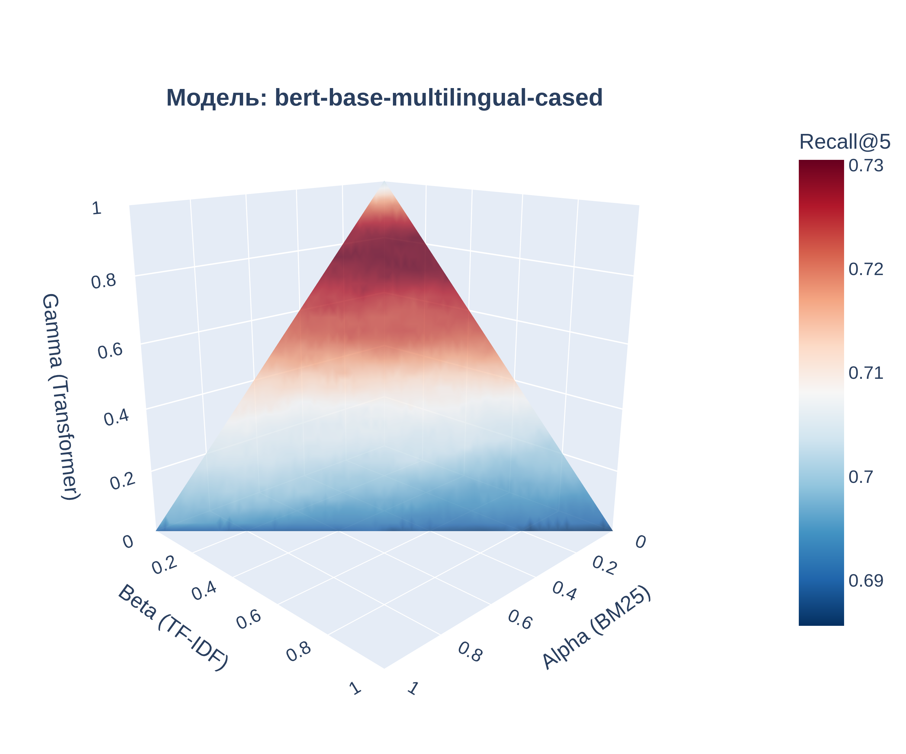

# Сравнительный анализ лексических и векторных подходов в задаче семантического поиска на русском языке


## Основные модули

### `Retrievers.py`

Содержит реализации трёх основных классов для извлечения релевантных документов:
- `TransformerRetriever` — поиск с использованием трансформеров;
- `LexicalRetriever` — поиск с использованием `BM25`, `TF-IDF`;
- `HybridScorer` — комбинированный подход с объединение сигналов от моделей `BM25`, `TF-IDF` и `Transformer` в виде линейной комбинации с весами `α`, `β`, `γ` соответственно.

### `model_quality.py`

- `grid_search_weights()` — перебор весов (`α`, `β`, `γ`) для гибридной модели с целью максимизации метрики `Recall@5`;
- `make_recall_function()` — функция, вычисляющая `Recall@k` для заданной трансформерной модели `TransformerRetriever`.

### `pipline_functions.py`

Функции для проведения экспериментов над трансформерными моделями, включая:
- инициализацию лексических и трансформерных моделей;
- формирование / сериализацию / загрузку эмбеддингов;
- grid search по весам `α`, `β`, `γ` гибридной модели;
- проверку статистической значимости различий между гибридным и трансформерным подходом по метрике Recall@5. 

### `plotting.py`

- Визуализация зависимости `Recall@5` от весов `α`, `β`, `γ` с помощью 3D-графиков для визуального анализа.



---

## Данные

Для экспериментов используется синтетический корпус [**RuHNP**](https://huggingface.co/datasets/deepvk/ru-HNP#ruhnp), включающий:
- 2000 текстов-запросов на русском языке из Wikipedia,
- по 5 синонимов и 5 антонимов к каждому запросу, сгенерированных при помощи `gpt-3.5-turbo`.

---

## Запуск экспериментов

Пример запуска пайплайна (см. `pipline_functions.py`):
```python
from pipline_functions import run_full_pipeline

run_full_pipeline(transformer_name="ai-forever/sbert_large_nlu_ru")
